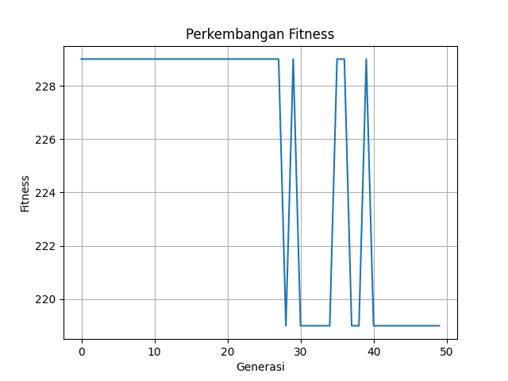

# Optimasi Knapsack Problem menggunakan Algoritma Genetika

Proyek ini bertujuan untuk menyelesaikan permasalahan **0/1 Knapsack Problem** dengan menggunakan **Algoritma Genetika (Genetic Algorithm)**. Knapsack Problem adalah masalah optimasi kombinatorial di mana kita harus memilih barang dengan nilai total maksimal tanpa melebihi kapasitas berat tertentu.

## 🚀 Fitur Utama
- **Modul Terpisah**: Logika inisialisasi, evaluasi, seleksi, crossover, dan mutasi dipisah untuk kemudahan pemeliharaan.
- **Berbagai Metode Seleksi & Operator**: Mendukung berbagai teknik seleksi (Roulette Wheel, Tournament) dan variasi crossover/mutasi.
- **Visualisasi Real-time**: Menampilkan grafik perkembangan fitness (terbaik, terburuk, rata-rata) di setiap generasi.
- **Auto-Save Plot**: Grafik hasil otomatis disimpan sebagai `fitness_plot.png`.

## 📂 Struktur Repositori
| File | Deskripsi |
|------|-----------|
| `main.py` | Skrip utama untuk menjalankan alur algoritma genetika. |
| `inisiasipopulasi.py` | Fungsi untuk membuat populasi awal kromosom biner. |
| `evaluasifitness.py` | Menghitung nilai fitness berdasarkan total harga dan penalti berat. |
| `selection.py` | Implementasi metode seleksi individu (Orang Tua). |
| `crossover.py` | Mekanisme persilangan genetik untuk menghasilkan keturunan. |
| `mutation.py` | Mekanisme mutasi untuk menjaga keragaman genetik. |

## 🛠️ Cara Penggunaan

1. **Persiapan Lingkungan**
   Pastikan Anda telah menginstal `numpy` dan `matplotlib`:
   ```bash
   pip install numpy matplotlib
   ```

2. **Menjalankan Program**
   Eksekusi file `main.py`:
   ```bash
   python main.py
   ```

3. **Melihat Hasil**
   - Output konsol akan menampilkan nilai fitness terbaik dan barang yang terpilih.
   - Grafik perkembangan fitness akan muncul di jendela baru dan tersimpan sebagai `fitness_plot.png`.

## 📊 Hasil Visualisasi
Berikut adalah contoh grafik perkembangan fitness yang dihasilkan oleh program:



*Grafik menunjukkan nilai fitness tertinggi (biru), terendah (kuning), dan rata-rata (merah) di setiap generasi.*

## ⚙️ Parameter Default
Program ini menggunakan parameter berikut pada `main.py`:
- **Generasi**: 50
- **Populasi**: 20
- **Probabilitas Crossover**: 0.5
- **Probabilitas Mutasi**: 0.1
- **Kapasitas Knapsack**: 50 unit

---
*Dibuat untuk tugas Praktikum Kecerdasan Buatan (Pertemuan 9).*
